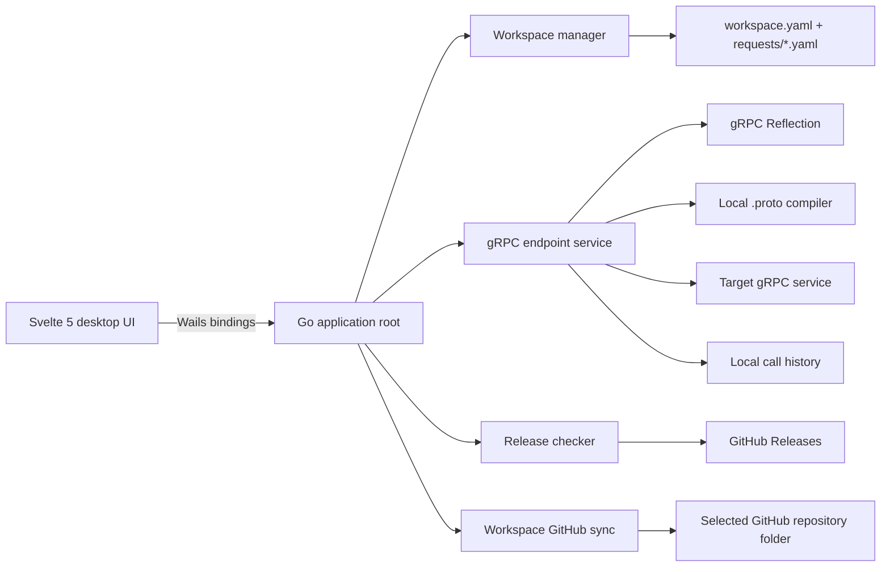

# Catenar

<p align="center">
  <strong>A desktop gRPC client and traffic workspace for developers.</strong><br />
  Connect to gRPC services, inspect contracts, send unary and streaming calls, and keep reusable request flows in a local workspace.
</p>

<p align="center">
  <a href="https://github.com/Rammbloor/catenar/actions/workflows/release.yml"></a>
  <a href="https://github.com/Rammbloor/catenar/releases"></a>
  <a href="LICENSE"></a>
</p>

## What Catenar is for

Catenar is a local-first desktop application for working with gRPC APIs. It is intended for developers who need a focused tool for exploring a service contract, constructing requests, observing calls, and retaining the working context between sessions.

It is **not** a hosted proxy: service traffic is initiated from the user's machine, and workspace data remains local unless the user explicitly links a workspace to a GitHub repository.

### Main capabilities

- Create and test gRPC endpoint connections with TLS preflight checks.
- Load service and method catalogs from gRPC Server Reflection or local `.proto` sources.
- Send unary calls and work with server, client, and bidirectional streaming flows.
- Edit JSON request payloads, metadata, and authorization data.
- View responses, gRPC statuses, call history, request timings, and diagnostics.
- Save, preview, rename, reuse, and delete reusable requests inside a workspace.
- Keep workspaces and the last opened state on disk; synchronize only a workspace manifest and its saved requests with an existing GitHub repository folder.
- Use dark or light appearance, Russian or English UI, and configurable keyboard shortcuts.

## Architecture



| Area | Responsibility | Important paths |
| --- | --- | --- |
| Desktop shell | Wails lifecycle, native dialogs, bindings, embedded frontend | `main.go`, `app.go` |
| Interface | Client, traffic, settings, diagnostics, theme and localization | `frontend/src/` |
| gRPC runtime | Transport, reflection, proto parsing, unary and stream calls, history | `internal/endpoint/` |
| Workspaces | YAML manifests, saved requests, validation, restoration of last active workspace | `internal/workspace/` |
| GitHub Sync | Isolated synchronization of workspace files and credential handling | `internal/githubsync/` |
| Version checks | Reads the latest GitHub Release, compares versions, and selects the matching installer/download asset | `internal/appupdate/` |
| CI/release | Builds and publishes artifacts for supported operating systems | `.github/workflows/release.yml` |

## Quick start for users

1. Download the artifact for your operating system from [GitHub Releases](https://github.com/Rammbloor/catenar/releases).
2. Start Catenar.
3. Create a connection and point it to your gRPC endpoint.
4. Load its catalog through Reflection, or add the required `.proto` sources.
5. Select a method, prepare a payload and press **Send**.
6. Create a workspace when you want to persist endpoints, saved requests, environments, and workspace settings.

### Supported release artifacts

| System | Release artifact | How to start |
| --- | --- | --- |
| macOS Apple Silicon and Intel | `catenar-<version>-darwin-universal.zip` | Unzip, move `Catenar.app` to `Applications`, then open it. |
| Windows x64 | `catenar-<version>-windows-amd64-installer.exe` | Run the NSIS installer. |
| Linux x64 | `catenar-<version>-linux-amd64` | Make executable: `chmod +x catenar-<version>-linux-amd64`, then run it. |

For Linux, the installed system must provide GTK3 and WebKit2GTK runtime libraries. The exact package names are distribution-dependent.

## Workspaces and saved requests

A workspace is a portable, file-backed YAML project. It owns the connection presets, proto source references, environments, workspace privacy settings, and saved requests used by the application.

```text
my-service-workspace/
├── workspace.yaml
└── requests/
    ├── create-user.yaml
    └── get-user.yaml
```

- `workspace.yaml` is the workspace manifest.
- `requests/*.yaml` contain reusable request definitions.
- Request and metadata values can reference the selected workspace environment.
- Sensitive material is not written into the workspace by the GitHub token flow.
- Catenar remembers the last active workspace and restores it when the application starts.

See [GitHub workspace sync](docs/github-workspace-sync.md) for the synchronization boundary and conflict flow.

## GitHub workspace synchronization

GitHub synchronization is opt-in and scoped. Catenar manages only:

```text
<selected-repository-folder>/
├── workspace.yaml
└── requests/
```

It does not read, overwrite, commit, or upload other files from a non-empty repository.

For an HTTPS repository, create a GitHub **fine-grained Personal Access Token** limited to the selected repository with **Contents: Read and write**, paste it in **Settings → Workspace → GitHub Sync**, and save it. The token is saved outside the workspace:

- macOS: Keychain;
- Windows: Credential Manager.

SSH repository URLs remain supported through the user’s existing SSH configuration. Do not place a token in the repository URL.

## Development setup

### Prerequisites

- Go version required by [`go.mod`](go.mod).
- Node.js 22 or later and npm.
- Wails CLI v2.12.0:

  ```bash
  go install github.com/wailsapp/wails/v2/cmd/wails@v2.12.0
  ```

- Native desktop dependencies for your platform. Run `wails doctor` after installing Wails to validate the environment.

Platform-specific requirements:

| Platform | Required components |
| --- | --- |
| macOS | Xcode Command Line Tools: `xcode-select --install` |
| Windows | WebView2 Runtime; NSIS only when building the installer |
| Linux | C compiler, GTK3 development files and WebKit2GTK development files |

On newer Linux distributions that provide WebKit2GTK 4.1 rather than 4.0, use the Wails build tag `webkit2_41`.

### Install dependencies

```bash
git clone https://github.com/Rammbloor/catenar.git
cd catenar
cd frontend && npm ci && cd ..
wails doctor
```

### Run in development mode

```bash
wails dev
```

This starts the desktop application with the Vite development server and Wails bindings. The frontend can also be run separately for styling work:

```bash
cd frontend
npm run dev
```

### Quality checks

Run all checks before opening a pull request or publishing a release:

```bash
go test ./...

cd frontend
npm run check
npm test -- --run
npm run build
```

The project treats these as release gates: Go tests cover application services, workspace behavior and gRPC flows; the frontend checks Svelte and TypeScript and runs Vitest tests.

## Build from source

Build on the target operating system. Wails v2 uses native system dependencies, so the release workflow builds each target on its own GitHub-hosted runner.

### macOS

```bash
wails build -platform darwin/universal
```

The output is `build/bin/Catenar.app`. For distribution outside a development machine, sign and notarize the application with an Apple Developer certificate.

### Windows

```powershell
wails build -platform windows/amd64 -nsis
```

The Windows executable and NSIS installer are written to `build/bin`. Production distribution should code-sign the executable and installer.

### Linux

```bash
wails build -platform linux/amd64
```

If your distribution uses WebKit2GTK 4.1:

```bash
wails build -platform linux/amd64 -tags webkit2_41
```

The executable is written to `build/bin`.

## Release process

Publishing a Git tag matching `v*` triggers [the release workflow](.github/workflows/release.yml).

```bash
git tag v1.0.0
git push origin v1.0.0
```

The workflow:

1. runs Go and frontend quality gates before packaging;
2. builds macOS universal, Windows x64 and Linux x64 artifacts on native runners;
3. injects the version from the tag into `wails.json` and the Go application;
4. creates the Windows NSIS installer;
5. packages release artifacts and generates `SHA256SUMS.txt`;
6. creates a GitHub Release and uploads all artifacts.

The application’s **Settings → Updates** page checks the latest GitHub Release for a higher version. When a compatible artifact is attached, it opens the exact installer/download for the running platform; otherwise it opens the release page. Release installation behavior is documented in the [update delivery section](#update-delivery-and-security) below.

### Update delivery and security

The current release checker is an availability check: it compares the running version with the latest GitHub Release and directs the user to that release. It does **not** silently replace a running application binary. This is intentional until each platform has a signed, verified installer/update package and a platform-specific installer handoff.

Before enabling in-place automatic installation, releases must have all of the following:

- macOS Developer ID signing and notarization;
- Windows Authenticode signing with a timestamp;
- a signed and verified update manifest or installer checksum validation;
- rollback behavior for a failed update;
- an explicit user confirmation and restart handoff.

The release workflow currently builds artifacts and checksums but does not configure signing secrets. Treat unsigned artifacts as development/testing artifacts, not a public production release channel.

## Configuration and privacy

- gRPC service traffic is initiated from the local machine.
- Workspace data is written only to the workspace directory chosen by the user.
- Call history and diagnostics are local application data.
- Diagnostics export applies secret-redaction settings before writing an archive.
- GitHub tokens are stored in the operating system credential store, never in workspaces or repository URLs.
- GitHub workspace sync changes only the selected workspace folder in the repository.

## Repository map

```text
.
├── app.go                       # Wails-bound application API
├── main.go                      # Desktop application configuration
├── frontend/                    # Svelte 5 / TypeScript UI
├── internal/
│   ├── endpoint/                # gRPC connections, calls, history, diagnostics
│   ├── workspace/               # workspace files and saved requests
│   ├── githubsync/              # isolated workspace GitHub synchronization
│   ├── appupdate/               # GitHub Release version check
│   └── contracts/               # frontend/backend contracts
├── docs/                        # focused product and integration documentation
└── .github/workflows/release.yml # cross-platform release pipeline
```

## Documentation

- [GitHub workspace synchronization](docs/github-workspace-sync.md)
- [Release workflow](.github/workflows/release.yml)
- [Wails build guide](https://wails.io/docs/gettingstarted/building/)
- [Wails supported platforms and prerequisites](https://wails.io/docs/v2.12.0/gettingstarted/installation/)

## Maintainers: evidence in this repository

The README describes the current implementation. Its main sources are `app.go`, `main.go`, `wails.json`, the service packages under `internal/`, frontend scripts in `frontend/package.json`, and `.github/workflows/release.yml`.

## License

Catenar is released under the [MIT License](LICENSE). It permits commercial and private use, modification and redistribution, provided that the copyright and license notice are retained. The software is provided without warranty.
